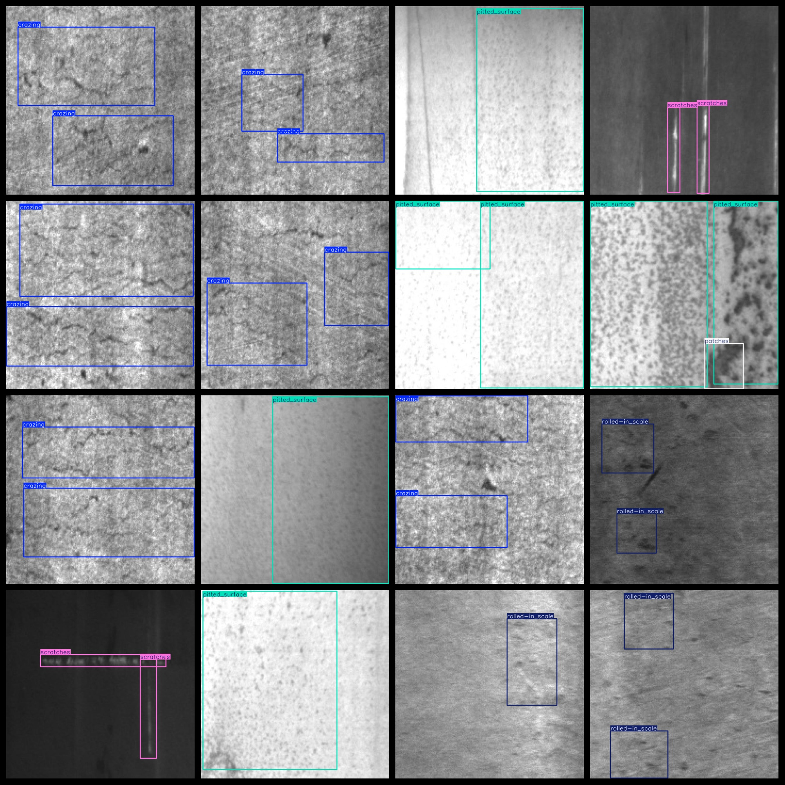

# Steel Rolling Surface Defect Dataset: 1799 Images in VOC+YOLO Format

The steel rolling surface defect dataset consists of 1799 images, organized in VOC format and YOLO format. The dataset is divided into three folders: JPEGImages, Annotations, and labels.

In the JPEGImages folder, there are a total of 1799 JPEG images.

The Annotations folder contains a total of 1799 XML files.

Lastly, the labels folder contains a total of 1799 txt files.

There are a total of 6 types of labels: ["crazing", "inclusion", "patches", "pitted_surface", "rolled-in_scale", "scratches"].

Each label has its own number of boxes (the box numbers in the Yolo format may not correspond directly to this, but they are based on the classes.txt in the labels folder).

- Crazing: 689 boxes
- Inclusion: 1011 boxes
- Patches: 878 boxes
- Pitted_surface: 432 boxes
- Rolled-in_scale: 628 boxes
- Scratches: 548 boxes

Total box numbers: 4186

The image resolution is clear.

The images have not been enhanced.

The labels are in the form of rectangular boxes, used for object detection recognition.

Important Note: No guarantees are made regarding the accuracy or weights of models trained with this dataset. The dataset only provides accurate and reasonable annotations.

Annotations and Image Details:

## Images

---

Here is a pay link on Stripe (https://buy.stripe.com/3cs8yP7sY87d0vu9AB). Please contact me lonlonago@foxmail.com after funding $89, and I will send you a complete data files, thank you!

